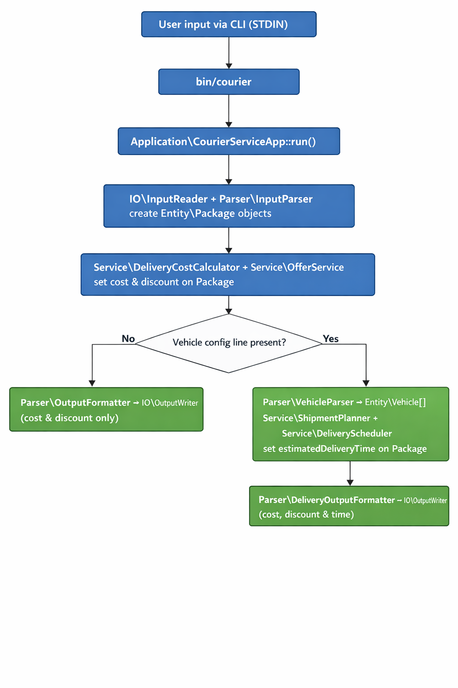

KikiCourier
===========

This project is a clean, TDD‑driven implementation of the **Kiki Courier**
coding challenge in PHP. It solves both problems:

1. **Problem 1 – Cost & discounts per package**
2. **Problem 2 – Multi‑vehicle scheduling with estimated delivery times**

The domain is modelled with value objects (`Money`, `Weight`, `Distance`,
`Speed`, `PackageId`), entities (`Package`, `Shipment`, `Vehicle`), and
services (`DeliveryCostCalculator`, `OfferService`, `ShipmentPlanner`,
`DeliveryScheduler`). The CLI is wired through `Application\CourierServiceApp`
and the `bin/courier` entrypoint.


Application flow
-----------------

The following diagram shows how the main pieces of the system fit together,
from the `bin/courier` entrypoint through parsers, services, and schedulers
down to the final CLI output:




Running the tests
-----------------

From the project root:

```bash
vendor/bin/phpunit
```

You should see all tests passing, including feature tests for both problems.


Running the CLI
----------------

The CLI reads from STDIN and writes to STDOUT. You can pipe input using
here‑documents.

### Problem 1 – cost & discounts only

Example (from the challenge statement):

```bash
php bin/courier << 'EOF'
100 3
PKG1 5 5 OFR001
PKG2 15 5 OFR002
PKG3 10 100 OFR003
EOF
```

Output format per line:

```text
<package_id> <discount_amount> <total_cost>
```


### Problem 2 – cost, scheduling, and delivery times

Example using the official sample scenario:

```bash
php bin/courier << 'EOF'
100 5
PKG1 50 30 OFR001
PKG2 75 125 OFR008
PKG3 175 100 OFR003
PKG4 110 60 OFR002
PKG5 155 95 NA
2 70 200
EOF
```

Expected output (one line per package, in order):

```text
PKG1 0 750 3.98
PKG2 0 1475 1.78
PKG3 0 2350 1.42
PKG4 105 1395 0.85
PKG5 0 2125 4.19
```

Output format per line:

```text
<package_id> <discount_amount> <total_cost> <estimated_delivery_time_hours>
```


Offers configuration
--------------------

Offers are configured via `config/offer.json` and loaded by
`OfferFactory::loadFromJson()`. If the JSON config is missing, a standard set
of offers (OFR001–OFR003) is created in code so the application still works
out of the box.
